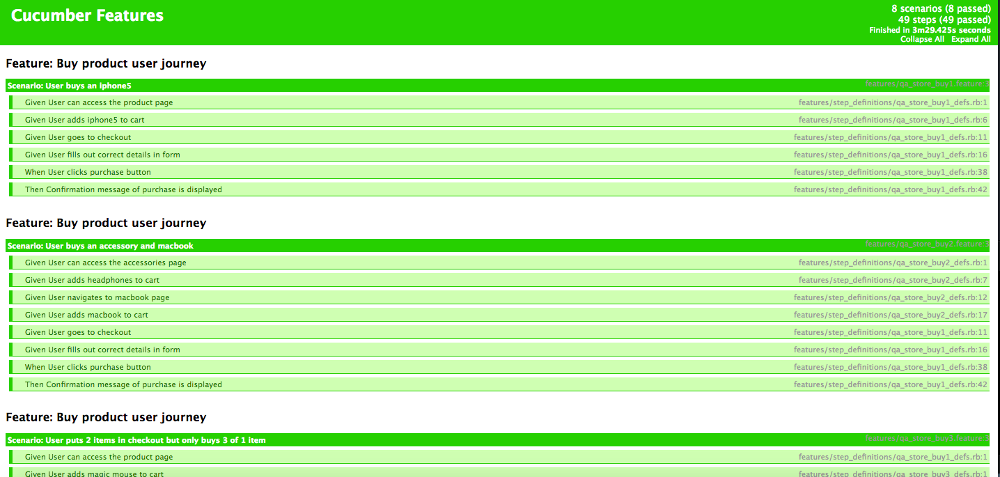

# sparta-cucumber-Ecommerce

## Task

Create an extensive UI automation test framework for the QA Tools e-Commerce Site (http://store.demoqa.com/) using Cucumber. It must :
* cover Register and Login
* cover at least 3 paths from Home to Completed Payment
* include data tables
* have a test report

## How to run

1. Go to https://github.com/cbryant93/sparta-cucumber-Ecommerce
2. Download zip folder
3. Open in terminal, and run tests by typing 'cucumber'
4. All tests should run green
5. Alternatively go to reports/test_html_report.html to view test results without running the tests

## Writing Feature files

Before coding any of the automations I needed to design what the scenarios. This is due to this type of testing being behaviour driven development. We need to break down what a user is able to do on the system into scenarios. An example of this is what I wrote for the scenario: 'A user is able to login'.

```Feature
Scenario: User needs to be able to login successfully
  Given User can access the QA login page
  And User inputs a valid username
  And User inputs a password
  When User clicks login button
  Then User is taken to profile page
```
Here you can see the format it written as
```Feature
  Given
  When
  Then
```
'Given' being the conditions, 'When' is the action the user does, and 'Then' is the result of the scenario being successful.

I was also able to include data tables for unsuccessful scenarios. This allows the automation to go through different data inputted in the login or register scenarios, to see what different error messages could be recieved. For example:

```Feature
Scenario Outline: If the user inputs the wrong username they recieve the corresponding error message
  Given User can access the QA login page
  Given User inputs an invalid <username>
  Given User inputs a valid password
  When User clicks login button
  Then User recieves the correct error message <error>

  Examples:

  | username | error |
  | fake | ERROR: Invalid username. Lost your password? |
```
As you can see here in the automation test, 'Fake' as a username will be inputted as a username in the login page to recieve the corresponding error message. I could put as many usernames as I wanted in the table and the test will run depending on how many usernames are in the data table.

## Writing tests

### Step Definitions

Once the feature files were written I ran 'cucumber' in the terminal and it gave me the code to copy and paste into a step definition file. Doing this creates a separate test for each given,when,then. I would then need to place methods into each test to run a test automation

### Pages

I would need to write automation methods into separate pages files. I created a separate file for each webpage the scenario may run through. In this case I have a:
* Registration page
* Login page
* Home page
* Product page
* Checkout page

For example in the login_page.rb I would have methods to input a username and password specifically for that web page.

```ruby
def click_login_link
  click_link(LOGIN_LINK)
end

def input_login_username(username)
  fill_in(LOGIN_ID, with: username)
end

def input_login_password(password)
  fill_in(PASSWORD_ID, with: password)
end

def submit_button
  find(LOGIN_SUBMIT)
end
```
I would then call these methods in the login step definition:
```ruby
And(/^User inputs a valid username$/) do
  qa_login_page.input_login_username('faketestQA123')
end

And(/^User inputs a password$/) do
  qa_login_page.input_login_password('x@%slEpdMDe4bg4W')
end

When(/^User clicks login button$/) do
   qa_login_page.click_submit_button
end
```
## Challenges

One of the main challenges I had in this task was dealing with the inconsistency of how the website has been coded. In some pages some input fields would have an ID I could target, however in other pages there would be no ID and I would have to find another way of targeting the field. Most of the time I solved this problem by targetting the CSS or the xpath of the item.

Another problem I found was when running the tests there would be a few anomalies. I'm not sure if it was a problem with cucumber or the way I coded my automations. When testing the automation of buying a product sometimes an item would not get added to the basket running the test first time round. However the second time without changing any code, it would add an item to the basket.

## Report
Once all my features were written in automation tests I wrote
```terminal
cucumber -f html -o test_html_report.html
```
into the terminal, which ran the tests I wrote as well as creating a html page of all the tests which had been ran.

Below you can see the final results for my tests:


